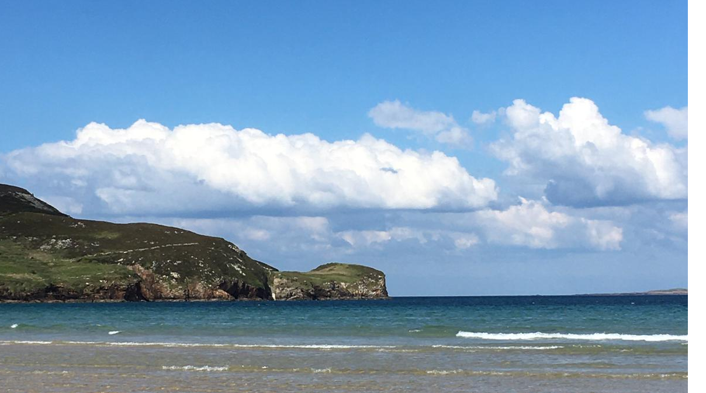

```{r setup, include=FALSE}
knitr::opts_chunk$set(echo = FALSE)
```

This is [World Ocean Day](https://worldoceanday.org/), and seeing as this time of year always finds us on the Donegal Coast, looking out over the North Atlantic, it seemed like a good time for a blog post.  

:::: {style="display: flex;"}

::: {}

```{r echo=FALSE, out.width='80%', preview = T}

```

:::

::: {}

This place is rife with wildlife, with a strong emphasis on bio-diversity, so I wanted that to feature in the post as well. Thus the idea became to produce a map showing observations of different species in the area.  

:::

::::

## The Observations  

For this, there is no better place than the [Global Biodiversity Information Facility](https://www.gbif.org/). The r package `rgbif` links directly to this, with the function `occ_search` doing the heavy lifting. The function can be spatially limited to a bounding box, we picked an area of about 20,000 km<sup>2</sup>. off the North and West Donegal coast. This is shown in the first code chunk below:

```{r libraries, echo=F}
library(tidyverse)
library(rgbif)
library(lubridate)
library(taxize)
library(sf)
library(leaflet)
library(kableExtra)
```

```{r bounding_box, echo=T}

bounds <- c('55.4045 -10.4181', 
            '54.2264 -10.4205',
            '54.2433 -8.4768',
            '54.5967 -8.1391',
            '54.6907 -8.7753',
            '55.1823 -8.1036',
            '55.2986 -7.0557',
            '55.4798 -7.3945')

wkt <- glue::glue(
  "POLYGON(({bounds[1]}, 
  {bounds[2]}, 
  {bounds[3]}, 
  {bounds[4]}, 
  {bounds[5]}, 
  {bounds[6]}, 
  {bounds[7]}, 
  {bounds[8]}, 
  {bounds[1]}))"
  )

species_observations <- occ_search(geometry = wkt)$data %>% 
  select(-key) %>% 
  distinct() %>% 
  mutate(sciname = str_remove(acceptedScientificName, "\\([^()]*\\)"),
         sciname = str_remove(sciname, "[^A-Z][A-Z][^q]*"),
         sciname = str_trim(sciname),
         date = strftime(eventDate, format = "%d %B %Y"))
```

```{r table_1, fig.height=8, echo=F}
species_observations %>% 
  select(Species = acceptedScientificName,
         longitude = decimalLatitude,
         latitude = decimalLongitude,
         date) %>% 
  distinct() %>% 
  kable("html") %>%
  kable_styling() %>%
  scroll_box(
    height = "200px",
    box_css = "border: 1px solid #ddd; padding: 5px; ",
    fixed_thead = TRUE
  )
```

<br>

The scientific species names are a little obscure, I'd like to map them to more familiar names. That's where the package `taxize` comes in. It can map the scientific names of species to their common names via the function `sci2comm`. But first we need to remove the information in parentheses for each observation, e.g <i>(Gmelin, 1789)</i>, that gives the naturalist and date of the species' classification.

```{r clean_species, echo=T}
species_observations <- species_observations %>% 
  select(Species = acceptedScientificName,
         longitude = decimalLatitude, # note how rgbif mixes up long and lat
         latitude = decimalLongitude, # note how rgbif mixes up long and lat
         phylum,
         order,
         family,
         genus,
         eventDate) %>% 
  distinct() %>% 
  mutate(sciname = str_remove(Species, "\\([^()]*\\)"),
         sciname = str_remove(sciname, "[^A-Z][A-Z][^q]*"),
         sciname = str_trim(sciname))
```

Now we can run the mapping to the species' common name.

```{r common_names, echo=T}
# species_observations$commonname <- sci2comm(species_observations$sciname)
# species_observations <- species_observations %>% 
#   mutate(commonname = unlist(commonname))
species_observations <- readRDS(file = "data/gbif")
```

Let's follow this up by making some neater labels for the map's pop-ups:

```{r map_labels, echo=T}
species_observations <- species_observations %>% 
  select(commonname, everything()) %>% 
  mutate(commonname = ifelse(commonname == "character(0)", sciname, commonname),
         commonname = str_to_title(commonname),
         genus = ifelse(is.na(genus), "", glue::glue("{genus}<br>")),
         family = ifelse(is.na(family), "", glue::glue("{family}<br>")))
```

And now, let's draw our map, colouring the points by the year of observation. Seeing as we're talking about the ocean here, I thought a bathyscape map would be best, hence the `addProviderTiles(providers$Esri.OceanBasemap)` line.

```{r map, echo=T}
pal <- colorNumeric("Reds", domain=(species_observations$year))

species_observations %>% 
  leaflet() %>% 
  addProviderTiles(providers$Esri.OceanBasemap) %>%
  setView(lng=-8.5, lat=54.8, zoom=7.2) %>% 
  addCircleMarkers(lng = ~ decimalLatitude, # note how rgbif mixes up long and lat
             lat = ~ decimalLongitude,# note how rgbif mixes up long and lat
             popup = ~paste("<b>", {commonname}, "</b><br>",  
                            phylum, "<br>",
                            order, "<br>",
                            family,
                            genus,
                            strftime(species_observations$eventDate, 
                                     format = "%d %B %Y")),
             color = ~pal(year),
             radius = 5)
```

See if you can find the two whales, one off Malin and the second off Belmullet, and the Portugeese sole from the 18<sup>th</sup> century.

Now, time for some watersports....