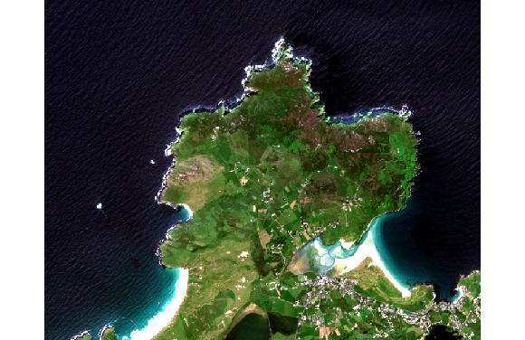

```{r setup, include=FALSE}
knitr::opts_chunk$set(echo = FALSE, message = F, warning = F)
rgl::setupKnitr(autoprint = TRUE)
options(rgl.useNULL = TRUE) # Suppress the separate window.
```

```{r libraries}
library(tidyverse)
library(raster)
library(rayshader)
library(rgl)
```

```{r data, cache=F}
login_details <- readRDS("../../../copernicus_login")
aoi <- readRDS("data/aoi")
query <- readRDS("data/sentinel-fields") %>% 
            dplyr::select(record_id, 
                   tile_id, 
                   orbit_number, 
                   date_acquisition, 
                   size,
                   cloudcov)
horn_head_10m_crop <- readRDS("data/horn-head-10m-crop")
N55_crop_utm <- readRDS("data/N55_crop_utm")
N55_crop_utm_matrix <- readRDS("data/N55_crop_utm_matrix")
```


The Donegal coast is pretty spectacular, no where more so than the beaches and cliffs around Sheephaven Bay. This post follows my attempt to produce a three dimensional model of part of this, namely Horn Head, using the `rayshader` package.

To produce the model, we'll need:

- an elevation matrix 

- an image of the peninsula to overlay on this  

Let's deal with the later first.

## Satellite Image of Horn Head from Sentinel-2

Accessing Sentinel-2 satellite images follows from the work of [Luigi Rancetti](https://luigi.ranghetti.info/post/safe-gcloud/), and a workshop from [Ewa Grabska](https://www.youtube.com/watch?v=k1K6nqgtRL8). I wanted an image from this Summer that we just spent up in Donegal, and on a day with low cloud coverage. The code to do this is shown below:

```{r sentinel, eval=FALSE, echo=TRUE}
library(getSpatialData)
library(sen2r)

set_aoi() # set to area around Dunfanaghy, -8, 55.2
time_range =  c("2021-06-01", "2021-08-15") #set time range
platform = "Sentinel-2" #choose platform
login_CopHub(username = login$user, password = login$pass) #login to Esa SCI-HUB

sentinel_records <- getSentinel_records(time_range, "Sentinel-2") %>% 
  filter(cloudcov < 20) %>% 
  select(record_id, date_acquisition, cloudcov)
```

This gives the following table of images:

```{r sentinel-results}
knitr::kable(tibble(Tile =query$tile_id, 
                    Orbit = query$orbit_number,
                    Date = query$date_acquisition,
                    Cloud = glue::glue("{round(query$cloudcov, 2)}%")
                    )
             )
```

The image from July 17<sup>th</sup> is clearly the best for clouds so we'll work with this. It has a `record_id` of `best_id =` `r query$record_id[3]`.

To download all `r query$size[3]` of this, we use the following code: `s2_download(best_id, outdir = "data")`.

The images we need are buried deep in the ensuing download directory under `data/S2B_MSIL2A_20210717T115359_N0301_R023_T29UNB_20210717T144509.SAFE/GRANULE/L2A_T29UNB_A022786_20210717T115402/IMG_DATA/R10m/` (look under the .SAFE directory then GRANULE, then look for IMG_DATA. The R10m means 10m resolution).

To construct the image we'll use:

```{r sentinel-image, eval=FALSE, echo=T}
base_image_file_10m <- "data/S2B_MSIL2A_20210717T115359_N0301_R023_T29UNB_20210717T144509.SAFE/GRANULE/L2A_T29UNB_A022786_20210717T115402/IMG_DATA/R10m/T29UNB_20210717T115359_"
b02_image_file_10m <- paste0(base_image_file_10m, "B02_10m.jp2")
b03_image_file_10m <- paste0(base_image_file_10m, "B03_10m.jp2")
b04_image_file_10m <- paste0(base_image_file_10m, "B04_10m.jp2")
horn_head_10m <- raster::stack(b02_image_file_10m, 
                       b03_image_file_10m, 
                       b04_image_file_10m)
ext = c(560000, 570000, 6113000, 6123000) # horn-head
horn_head_10m_crop <- crop(horn_head_10m, ext)
plotRGB(horn_head_10m_crop, r = 3, g = 2, b = 1, stretch = "lin")
```

Giving:

```{r echo=FALSE, out.width='80%', preview = F}

```

With a crs and extent of:

```{r}
raster::crs(horn_head_10m_crop) %>% proj4string()
raster::extent(horn_head_10m_crop)
```

## Elevation Data for Horn Head

For this part, we're leaning on the work of [Derek Watkins](https://dwtkns.com/srtm30m/) and the __Shuttle Radar Topography Mission__. From the website _dwtkns.com/srtm30m/_ you can zoom in on the relevant tiles (in this case N55W009 and N55W008) and download elevation data.

These tiles are then loaded into R, they are merged, and then cropped to the area of Horn Head. Note that we have to play around with projections because the elevation data comes in latlong format, but the sentinel data is utm. Then we have to change the elevation data in to a matrix. We finish by clipping the previous image data to the same extent as this elevation data.

```{r elevation, eval=F, echo=TRUE}
N55W009 <- raster("data/SRTM/N55W009.hgt")
N55W008 <- raster("data/SRTM/N55W008.hgt")
N55 <- raster::merge(N55W009, N55W008)

bottom_left = c(y=-8.058146434999939, x=55.17420873750392)
top_right   = c(y=-7.9232205897354686, x=55.233572425130)
extent_latlong = sp::SpatialPoints(rbind(bottom_left, top_right), proj4string=sp::CRS("+proj=longlat +ellps=WGS84 +datum=WGS84"))
extent_utm = sp::spTransform(extent_latlong, raster::crs(horn_head_10m))

N55_crop <- crop(N55, extent_latlong)
N55_crop_utm <- projectRaster(N55_crop, crs = crs(horn_head_10m), method = "bilinear")
N55_crop_utm_matrix <- rayshader::raster_to_matrix(N55_crop_utm)

horn_head_10m_crop <- crop(horn_head_10m, extent(N55_crop_utm))
```

This looks like this:


## Putting it Together with _rayshader_

For this part, we refer to [Tyler Morgan-Wall](https://www.tylermw.com/a-step-by-step-guide-to-making-3d-maps-with-satellite-imagery-in-r/). The Horn Head Image produced by plotRGB is saved to disk as a png and then opened up as an image.

```{r image, echo=TRUE, eval=FALSE}
img <- png::readPNG("img/horn-head-2021.png")

plot_3d(img, N55_crop_utm_matrix, windowsize = c(1000,1000), zscale = 5, shadowdepth = -50,
        zoom=0.5, phi=45,theta=-45,fov=70, background = "#F2E1D0", shadowcolor = "#523E2B")

render_snapshot(title_text = "Horn Head, Donegal | Imagery: Sentinel-2 | DEM: 30m SRTM",
                title_bar_color = "#1f5214", title_color = "white", title_bar_alpha = 1, asp=2)
```


The final snapshot looks something like this. Note the difficulty in layering over the steep cliffs on the North of the peninsula, I guess that's asking too much of Sentinel to capture them:


```{r, rgl-setup}
library(rgl)
knitr::knit_hooks$set(webgl = hook_webgl)
```

```{r, test-rgl, webgl=TRUE}
img <- png::readPNG("img/horn-head-2021.png")

plot_3d(img, N55_crop_utm_matrix, windowsize = c(1000,1000), zscale = 5, shadowdepth = -50,
        zoom=0.5, phi=45,theta=-45,fov=70, background = "#F2E1D0", shadowcolor = "#523E2B")
```
