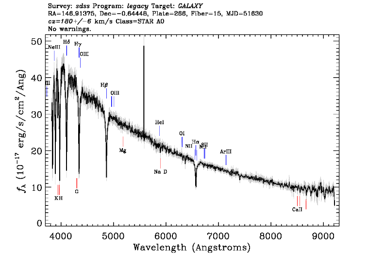

```{r setup, include=FALSE}
knitr::opts_chunk$set(echo = FALSE, message=F, warning=F)
```

When it comes to astronomical catalogues, SDSS was without peer for many years. We used it routinely for our work on differential photometry, and developed ways of accessing SDSS data directly to R. This post is really just a reminder-to-self, so that next time I need to get my SDSS data I won't need to scrabble around looking for old scripts.

The packages needed are [tidyverse](https://joss.theoj.org/papers/10.21105/joss.01686) (of course), [RCurl](https://CRAN.R-project.org/package=RCurl), and [glue](https://CRAN.R-project.org/package=glue).

```{r libraries}
library(tidyverse)
library(glue)
library(RCurl)
library(xml2)

theme_set(theme_minimal())
```

```{r params, cache=TRUE, echo = TRUE}
N <- 50
sub_N <- 10
delta <- 0.1
bands_min <- 15
bands_max <- 20
delta_gr_mag <- runif(n = 1, min = -2, max = +2)
delta_ri_mag <- runif(n = 1, min = -2, max = +2)
```


```{r sql, cache=TRUE, echo = TRUE}
# SQL that downloads some info on the chosen target from SDSS.
# ObjID from SDSS specifies the target

master_target_SqlQuery <- glue("SELECT top {N} p.ra, p.dec, ",
                       "p.u, p.g, p.r, p.i, p.z, p.objid, ", 
                       "s.specobjid, s.class, s.subclass, s.survey, ", 
                       "s.plate, s.mjd, s.fiberid ", 
                       "FROM photoObj AS p ", 
                       "JOIN SpecObj AS s ON s.bestobjid = p.objid ",
                       "WHERE p.g BETWEEN {bands_min} AND {bands_max} ",
                       "AND p.r BETWEEN {bands_min} AND {bands_max} ", 
                       "AND p.i BETWEEN {bands_min} AND {bands_max} ", 
                       "AND s.class = 'STAR' ",
                       "AND s.survey != 'eboss'" )
```

```{r data_download, cache=TRUE, echo = TRUE}
# downloads target data
# dataframe target has necessary info
master_target_SqlQuery <- str_squish(master_target_SqlQuery)
urlBase <- "http://skyserver.sdss.org/dr17/SkyserverWS/SearchTools/SqlSearch?"
X <- getForm(urlBase, cmd = master_target_SqlQuery, format = "csv")
master_targets <- read.table(text = X, header = TRUE, sep = ",", dec = ".", comment.char = "#")
```

```{r targets_table}
master_targets %>% 
  mutate(across(where(is.numeric), round, 2),
         objid = as.character(objid),
         specobjid = as.character(specobjid)) %>% 
  dplyr::slice_sample(n=5) %>%
  select(-class, -survey) %>% 
  gt::gt()
```


There are times when the SDSS data server is down. In this case, expect to see an error message like - "Error: InternalServerError".

Now that we have the plate, mjd, and fiberid for some stars, we can go ahead and download their spectra.

```{r spectrum_download, cache=TRUE, echo = TRUE}
index <- 1 # uses first star from list
get_spectrum <- function(object, wavelength_lower_limit = 5500, wavelength_upper_limit = 7000){
  plate <- object$plate
  mjd <- object$mjd
  fiber <- object$fiberid
  url_spect <- glue("http://dr12.sdss.org/csvSpectrum?plateid={plate}", 
                    "&mjd={mjd}&fiber={fiber}&reduction2d=v5_7_0")
  spectrum <- read_csv(file = url_spect)
  spectrum %>% 
    filter(between(Wavelength, wavelength_lower_limit, wavelength_upper_limit)) %>% 
    select(Wavelength, BestFit)
}
spect1 <- get_spectrum(master_targets[index,], 
                       wavelength_lower_limit = 3500, 
                       wavelength_upper_limit = 8000)
```

This gives a dataframe with wavelength and intensity. Let's plot this

```{r plot_spectrum}
spect1 %>% 
  mutate(Wavelength = Wavelength / 10) %>% 
  ggplot(aes(Wavelength, BestFit)) +
  geom_line() +
  scale_x_continuous(name = "Wavelength (nm)")
```

```{r finding-correct-objid}
radial_url_root <- "http://skyserver.sdss.org/dr17/SkyServerWS/SearchTools/SqlSearch?cmd="
radial_url_core <- "select top 1 p.objid 
FROM PhotoObj as p 
JOIN SpecObj AS s ON s.bestobjid=p.objid 
WHERE s.specobjid={master_targets[index,]$specobjid}" %>% 
  str_replace_all(" ", "%20") %>% 
  str_replace_all("\n", "")
w <- rvest::read_html(glue::glue(radial_url_root, radial_url_core, "&format=csv"))
my_objid <- as_list(w)$html$body$p[[1]] %>% 
  as.character() %>% 
  str_remove("#Table1\nobjid\n") %>% 
  str_remove("\n")
url_objid <- glue::glue("https://cas.sdss.org/dr17/VisualTools/explore/summary?objId={my_objid}")
```


The spectrum from sdss is shown below, and can be seen [here](`r url_objid`)



The SDSS image of the star itself is given here


Full code is available from [github](https://github.com/eugene100hickey/fizzics/tree/master/_posts/2021-12-16-sdss-data-access).

Note, for some reason the SDSS objid returned from the SQL query is incorrect. I'm still trying to figure out why and to fix this.
