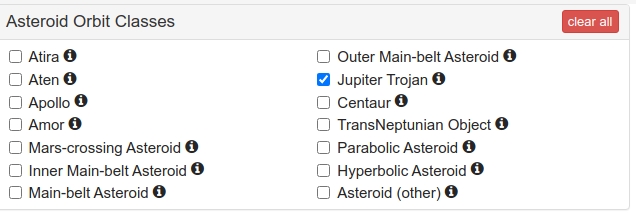

The Jupiter Trojans are two groups of asteroids, beyond the main asteroid belt in stable orbits at the L4 and L5 Lagrange points of Jupiter. This means that they are about the same distance from the Sun as Jupiter (5.2AU), and either $60^{\circ}$ ahead (L4) or behind (L5) Jupiter's orbit.

There are lots of them, comparable in number to the main asteroids. The larger ones are named and follow a convention using Greek (L4) or Trojan (L5) warriors. Except for the early ones, leading to some spies in the opposite camps.

Until [Lucy](https://www.nasa.gov/mission_pages/lucy/overview/index) reports back over the next few years, all we know about them comes from observations from Earth. We get a fascinating glimpse of their story. They look old and unprocessed, dark carbonaceous chondrites. They lend weight to the [Nice Model](https://en.wikipedia.org/wiki/Nice_model), making the Trojans kindred spirits to [Kuiper Belt](https://en.wikipedia.org/wiki/Kuiper_belt) objects. You can see how results from Lucy are anticipated with a lot of excitement.  

So let's have a look. Our data come from two sources; the [JPL Small Bodies Database](https://ssd.jpl.nasa.gov/tools/sbdb_query.html), and the [Minor Planet Centre](https://www.minorplanetcenter.net/iau/lists/JupiterTrojans.html). The data from the Minor Planet Centre we web scraped, but for JPL it was easier just to download a csv with data, limiting it to the Trojans and choosing pretty much all the data fields available. Joining the tables together was tricky, and required using a mixture of both _designation_ and _provisional designation_.




```{r setup, include=FALSE}
knitr::opts_chunk$set(echo = FALSE, message = F, warning = F)
```


```{r libraries}
library(tidyverse)
library(rvest)
library(lubridate)
library(showtext)
library(ggpointdensity)
library(ggtext)
library(ggokabeito)
library(patchwork)
```

```{r graphics}
font_add("Fuzzy Bubbles", regular = "fonts/FuzzyBubbles-Regular.ttf")
showtext_auto()

theme_clean <- function() {
  theme_minimal(base_family = "Fuzzy Bubbles") +
    theme(panel.grid.minor = element_blank(),
          text = element_text(size = 28, family = "Fuzzy Bubbles"),
          plot.background = element_rect(fill = "white", color = NA),
          axis.text = element_text(size = 32),
          axis.title = element_text(face = "bold", size = 36),
          strip.text = element_text(face = "bold", size = rel(0.8), hjust = 0),
          strip.background = element_rect(fill = "grey80", color = NA),
          legend.text = element_text(size = 24))
}
```


```{r data, cache=TRUE, echo = TRUE}
z <- read_csv("data/nasa-small-bodies-database.csv") %>%
  mutate(first_obs = as.Date(first_obs),
         designation = str_extract(full_name, pattern = "(?<=\\().*(?=\\))")) %>%
  dplyr::select(designation, pdes, name, spkid, diameter, albedo,
                rot_per, ma, n, first_obs)

url <- "https://www.minorplanetcenter.net/iau/lists/JupiterTrojans.html"

xml <- "pre"

w <- rvest::read_html(url)
pathway_data_html <- rvest::html_nodes(w, xml)
ev <- rvest::html_text(pathway_data_html) %>%
  str_split("\n") %>%
  unlist()
tjn <- ev[-c(1, 3, 10794)] %>%
  str_sub(start = 1, end = 8)
tjn <- tjn[-1] %>% 
  str_remove("\\(") %>% 
  str_remove("\\)") %>% 
  str_remove(" +")
ev <- ev[-c(1, 3)] %>%
  str_sub(start = 28) %>%
  str_replace_all(" +", " ")

trojans <- read_table(ev) %>%
  janitor::clean_names() %>%
  unite(col = design, prov:des, sep = " ", remove = F) %>% 
  mutate(pdes = tjn)

z <- z %>% left_join(trojans %>% select(pdes, design))

trojans <- trojans %>%
  select(-pdes) %>% 
  left_join(z) %>% 
  filter(h < 30)
```


```{r data_sizing, cache=TRUE}

```

### Trojan Orbits

Let's first off look at where the Trojans are. Below we show the distributions for aphelion and perihelion distance, and the relationship between them.

```{r distances, fig.height=8}
perihelion <- trojans %>% 
  ggplot() +
  geom_histogram(aes(q, fill = ln, y = ..ncount..), 
                 position = "dodge",
                 show.legend = F) +
  scale_fill_okabe_ito() +
  scale_x_log10() +
  theme_clean() +
  theme(axis.title = element_blank(),
        axis.text.y = element_blank())

aphelion <- trojans %>% 
  ggplot() +
  geom_histogram(aes(q_2, fill = ln, y = ..ncount..), 
                 position = "dodge",
                 show.legend = F) +
  scale_fill_okabe_ito() +
  scale_x_log10() +
  theme_clean() +
  theme(axis.title = element_blank(),
        axis.text.y = element_blank())

semi_major <- trojans %>% 
  ggplot(aes(q, q_2, col = ln)) +
  geom_point(size = 0.1, show.legend = F) +
  scale_color_okabe_ito() +
  labs(x = "Perihelion (AU)", y = "Aphelion (AU)") +
  theme_clean()
  
(perihelion + aphelion) / semi_major +
  plot_annotation(
    title = "Perhelion (left) and Aphelion (right) distributions<br>for the  <span style='color:#E69F00;'>L4</span> and <span style='color:#56B4E9;'>L5</span> Jupiter Trojans. All distances in AU",
    theme = theme(plot.title = element_markdown(size = 32,
                                                family = "Fuzzy Bubbles"),
                  axis.text = element_text(size = 24),
                  axis.title = element_text(size = 24)))
```

Nothing here seems too startling, and the eccentricities for L4 and L5 seem similar.

In the main asteroid belt we see evidence of several collisional families, asteroids groups with a narrow range of inclinations along a strip of semi-major axes. These are all formed by some impact in the past. Let's' see if there is evidence of this in the Trojans.

```{r collision_families}
trojans %>% ggplot(aes(a, incl, col = ln)) +
  geom_point(size = 0.1, show.legend = F) +
  scale_color_okabe_ito() +
  labs(title = "Orbital Inclination versus Semi-Major Axis<br>for the <span style='color:#E69F00;'>L4</span> and <span style='color:#56B4E9;'>L5</span> Jupiter Trojans.",
       y = "Inclination <span>&#176;</span>",
       x = "Semi-Major Axis (AU)") +
  scale_fill_okabe_ito() +
  theme_clean() + 
  theme(plot.title = element_markdown(size = 32, family = "Fuzzy Bubbles"),
        axis.title.y = element_markdown(size = 24, family = "Fuzzy Bubbles"),
        axis.title.x = element_markdown(size = 24, family = "Fuzzy Bubbles"))
  
```

We see no sign of these collisional families here. This squares with the Nice model, the origin of the Trojans is late capture of Kuiper Belt objects. The timing means that they avoided most of the maelstrom of early Solar System formation.

Looking at the inclinations of these asteroids, we can see that L5 Trojans tends to have higher inclinations. This is something that has been [noticed already](https://ui.adsabs.harvard.edu/abs/2020IAUS..345..345S/abstract) but not yet explained.

```{r inclinations}
trojans %>% ggplot() +
  geom_histogram(aes(incl, fill = ln, y = ..ncount..), 
                 position = "dodge",
                 show.legend = F) +
  labs(title = "Orbital Inclination distributions<br>for the <span style='color:#E69F00;'>L4</span> and <span style='color:#56B4E9;'>L5</span> Jupiter Trojans.",
       x = "Inclination <span>&#176;</span>") +
  scale_fill_okabe_ito() +
#  scale_x_log10() +
  theme_clean() + 
  theme(plot.title = element_markdown(size = 32, family = "Fuzzy Bubbles"),
        axis.title.x = element_markdown(size = 32, family = "Fuzzy Bubbles"),
        axis.title.y = element_blank(),
        axis.text.y = element_blank())
```

### Trojan Physical Properties

The Trojans are dark, much darker than the stony (S type) or metallic (M type) asteroids that we frequently find in the main asteroid belt. Let's see how this stacks up with our data, examining the albedo of our Trojans.

```{r albedo}
my_title <- "Albedo distributions for the <span style='color:#E69F00;'>L4</span> and <span style='color:#56B4E9;'>L5</span> Trojans."
trojans %>% 
  ggplot() +
  geom_histogram(aes(albedo, fill = ln, y = ..ncount..),
                 position = "dodge", 
                 show.legend = F) +
  scale_fill_okabe_ito() +
  labs(title = my_title,
       x = "Albedo") +
  theme_clean() + 
  theme(axis.title.y = element_blank(),
        axis.text.y = element_blank(),
        plot.title = element_markdown())
```

We're seeing albedos typically around 0.05-0.1, with some very dark bodies indeed, and a minimum albedo of `r min(trojans$albedo, na.rm = T) %>% signif(2)`.  

```{r rotations}
my_title <- "Rot<sup>n</sup> Period distributions for the <span style='color:#E69F00;'>L4</span> and <span style='color:#56B4E9;'>L5</span> Trojans."
trojans %>% 
  ggplot() +
  geom_histogram(aes(rot_per, fill = ln, y = ..ncount..),
                 position = "dodge", 
                 show.legend = F) +
  scale_fill_okabe_ito() +
  scale_x_log10() +
  labs(title = my_title,
       x = "Rotational period (hours)") +
  theme_clean() + 
  theme(axis.title.y = element_blank(),
        axis.text.y = element_blank(),
        plot.title = element_markdown())
```

We see typical periods of 1o hours, the Solar Systems favourite period, but some slow rotators with periods up to 1000 hours.

Finally, let's look at the Trojan asteroid size distribution. Lots of these asteroids don't have diameters in the minor planet centre database, so we've imputed then based on absolute magnitude and [this look up table](https://www.minorplanetcenter.net/iau/Sizes.html). The table gives sizes in three units (kilometres, metres, and millimetres), for $\frac12$ integer absolute magnitude values. We did a loess interpolation to fit the actual absolute values to this curve.

```{r diameters, echo = T}
# sizing
url_size <- "https://www.minorplanetcenter.net/iau/Sizes.html"
w <- rvest::read_html(url_size)
pathway_data_html <- rvest::html_nodes(w, xml)
ev <- rvest::html_text(pathway_data_html) %>%
  str_split("\n") %>%
  unlist()
ev <- ev[-c(1:4, 6, 37:47)] %>% 
  str_replace_all(" - ", "   ") %>% 
  str_replace_all(" +", " ")
ev[1] <- "H1 D_min_icy D_min D_max H2 H3"
trojan_dist <- read_table(ev) %>% 
  pivot_longer(cols = c(H1, H2, H3)) %>% 
  mutate(new_diameter = case_when(name == "H1" ~ (D_min + D_max)/2,
                           name == "H2" ~ (D_min + D_max)/2/1e3,
                           name == "H3" ~ (D_min + D_max)/2/1e6)) %>% 
  arrange(name, value) %>% 
  select(h = value, everything()) %>% 
  select(-name)

calibration <- loess(new_diameter ~ h, data = trojan_dist, span = 0.25)
trojans <- trojans %>% 
  mutate(new_diam = predict(calibration, newdata = trojans), 
         diameter = ifelse(is.na(diameter), new_diam, diameter))
```

Then we can produce the plot as shown below:

```{r diameters_plot}
trojans %>% 
  ggplot() +
  geom_histogram(aes(diameter, fill = ln, y = ..ncount..),
                 position = "dodge", 
                 show.legend = F) +
  scale_fill_okabe_ito() +
  scale_x_log10() +
  labs(title = "Diameter distributions for the <span style='color:#E69F00;'>L4</span> and <span style='color:#56B4E9;'>L5</span> Trojans.",
       x = "Diameter (km)") +
  theme_clean() + 
  theme(axis.title.y = element_blank(),
        axis.text.y = element_blank(),
        plot.title = element_markdown())
```

### And the data

This is an excerpt from the data table, all the asteroids but not all the columns

```{r data_table}
trojans %>% 
  select(Name = name,
         Designation = design,
         Lagrange = ln,
         Perihelion = q,
         Aphelion = q_2,
         Diameter = diameter,
         Albedo = albedo,
         Rotation = rot_per) %>% 
  DT::datatable()
```

