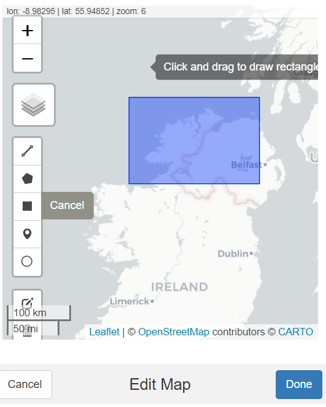
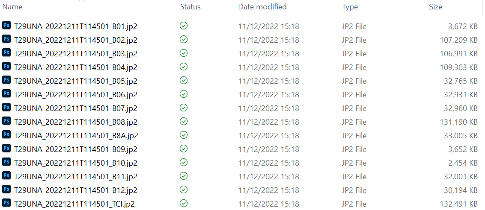

```{r setup, include=FALSE}
knitr::opts_chunk$set(echo = FALSE)
```

Geological Survey Ireland is producing wonderful [data resources](https://www.gsi.ie/en-ie/data-and-maps/Pages/default.aspx), impossible to resist when it comes to doing some analysis. In this post, welook at [bedrock data](https://www.gsi.ie/en-ie/data-and-maps/Pages/Bedrock.aspx#100k), what you would see after sweeping away all the soil and loose covering from the ground. Bedrock is stuff like sandstone, limestone, igneous rock.... 

I was interested to see how overlying vegetation depends on the bedrock; specifically if the colours from satellite images taken at different times of year could be used to take a guess at what lies beneath. 

This requires two suites of information, the bedrock data from GSI and the satellite data from [Copernicus-Sentinel](https://scihub.copernicus.eu/). The first we'll download directly and store locally from [this resource](https://www.gsi.ie/en-ie/data-and-maps/Pages/Bedrock.aspx#100k), the second we'll access using the R package, [sen2r](https://github.com/ranghetti/sen2r) (but we'll also end up downloading and storing image files locally, but `sen2R` will help scope them out).

This was originally written as one post, but then it got so long I decided to split it into three parts:

- [Part I: getting the bedrock data from GSI](https://www.fizzics.ie/posts/2023-01-17-satellites-and-bedrock/)  
- **Part II: getting the satellite data from Sentinel  **
- Part III: putting the first two together  


```{r libraries-theme}
library(tidyverse)
library(sf)
library(sen2r)
library(getSpatialData)
library(raster)
library(RStoolbox)
library(exactextractr)
# library(terra)
library(showtext)
library(gt)
library(ggokabeito)

font_add_google(name = "Gloria Hallelujah", family = "my_font")
showtext_auto()
theme_clean <- function() {
  theme_minimal(base_family = "my_font") +
    theme(panel.grid.minor = element_blank(),
          text = element_text(size = 16, family = "my_font"),
          plot.background = element_rect(fill = "white", color = NA),
          axis.text = element_text(size = 16),
          axis.title = element_text(face = "bold", size = 14),
          strip.text = element_text(face = "bold", size = rel(0.8), hjust = 0),
          strip.background = element_rect(fill = "grey80", color = NA),
          legend.text = element_text(size = 16, family = "my_font"))
}
```

This post is largely inspired by the work of [Ewa Grabska](https://github.com/WhyR2020/workshops/blob/master/satellite/whyr_satellite.R) and a [WhyR presentation she made in 2020](https://www.youtube.com/watch?v=k1K6nqgtRL8). She has a much clearer and in-depth view of the topic than I do.

Getting access to [Sentinel satellite](https://scihub.copernicus.eu/) data requires making an account at [scihub](https://scihub.copernicus.eu/dhus/#/self-registration). It's free and open access. And once you have your login details you can do most of the leg work without leaving rstudio thanks to the `sen2r` and `getSpatialData` packages. As we'll see, the only time we'll leave rstudio is to unzip a downloaded file.

The first thing to do is to set an area of  interest (aoi) using the `set_aoi()` function from `getSpatialData`. This pulls up a map of  the globe in the rstudio viewer panel that can be zomed and panned to the geographical area of interest. When you're there, click on the area select tool (black box on the left), place that on the map, and then click _Done_. This is shown below:

```{r aoi-picture, fig.align='center'}

```


You can check that all has worked well using the `getSpatialData::get_aoi()` and the `getSpatialData::view_aoi()` functions.

Next, we set the time frame of interest (early Summer is shown below), and the satellite platform de choix (Sentinel-2). And then we log in to Copernicus; a dialogue box will pop up asking you for your password.

```{r aoi, eval=FALSE, echo = TRUE}
time_range =  c("2022-05-03", "2022-07-28") #set time range
platform = "Sentinel-2" #choose platform
login_CopHub("eugene100hickey")
```

```{r aoi-2}
aoi <- readRDS("data/aoi")
query <- readRDS("data/query")
```

Now it's time to see what Sentinel kows about this patch of Earth in this time period. The `getSpatialData::getSentinelRecords()` function is our friend here.

```{r aoi-3, eval=FALSE, echo=TRUE}
query <- getSentinel_records(time_range, "Sentinel-2")
```

This `query` is an `sf` object and is work looking at in detail. It could contains hundreds of individual records from Sentinel. It tells us about the size of each of the image file collections, what instrument on board the satellite was used, the precise time of measurement (always around mid-day, of  course) as well as estimates of water coverage, snow and ice, and, importantly for images of Ireland, the amount of cloud cover. 

We'll filter on this last one, clouds may be beautiful, but they're of no scientific interest here. In our case, this reduces the number of Sentinel fields from the hundreds down to a few tens.

```{r cloud-filter, echo=TRUE}
query5 <- query |> filter(cloudcov < 5)
```

<input type=button class=hideshow>

```{r cloud-query}
query5 |> 
  sf::st_drop_geometry() |> 
  dplyr::select(platform_serial, start_time, size, cloudcov, water) |> 
  dplyr::group_by(start_time) |> 
  filter(row_number() == 1) |> 
  ungroup() |> 
  gt::gt() |> 
  cols_label(
    platform_serial = md("Satellite"),
    start_time = md("Date & Time"),
    size = md("File Size"),
    cloudcov = md("Cloud Cover (%)"),
    water = md("Water (%)")
  ) |> 
  fmt_number(
    columns = c(cloudcov, water),
    decimals = 1
  ) |> 
  cols_align(
    columns = size,
    align = "right"
  )
```


Before downloading all this data, it's good to have a sneak preview as to what they look like. To that end, we'll use the `getSpatialData::get_previews()` function and then take a look with the `getSpatialData::view_previews()` function. 

```{r previews, echo=TRUE, eval=FALSE}
records <- get_previews(query, dir_out = "/home/some-directory/")
view_previews(records)
# you can also see an individual record with, e.g. view_previews(records[1,])
```

This gives a mosaic of Sentinel captures, something like as seen below:

```{r preview-picture, fig.align='center', preview=TRUE}
knitr::include_graphics("images/previews.png")
```

We then go and fetch the actual records (in this case the 10<sup>th</sup> one) we need with:
```{r archive, eval=FALSE, echo=TRUE}
set_archive("/home/some-directory/my-archive")
getSentinel_data(records[10,])
```

This gives a zipped file. We unpack this where we want it to live. Later on, the files we care about will end up in a subfolder called `GRANULE/Some-Sentinel-ID/IMG-DATA`, where `Some-Sentinel-ID` is a long string made from a combination of image time, instrument, date.... This leads to a bunch of (mostly) `jp2` files corresponding to different wavelength bands from blue to far infrared. 

```{r files, fig.align='center'}

```

From these image files, the only ones we'll use will be the `******_B02.jp2` (red band), `******_B03.jp2` (green band), `******_B04.jp2` (blue band), and `******_B08.jp2` (IR band). We'll see in  the next installment how to stack these in to one image, and how to connect the colours back to our bedrock data.

</input>

<script>
$( "input.hideshow" ).each( function ( index, button ) {
  button.value = 'Hide Output';
  $( button ).click( function () {
    var target = this.nextSibling ? this : this.parentNode;
    target = target.nextSibling.nextSibling.nextSibling;
    if ( target.style.display == 'block' || target.style.display == '' ) {
      target.style.display = 'none';
      this.value = 'Show Output';
    } else {
      target.style.display = 'block';
      this.value = 'Hide Output';
    }
  } );
} );
$("input.hideshow").click()
</script>

