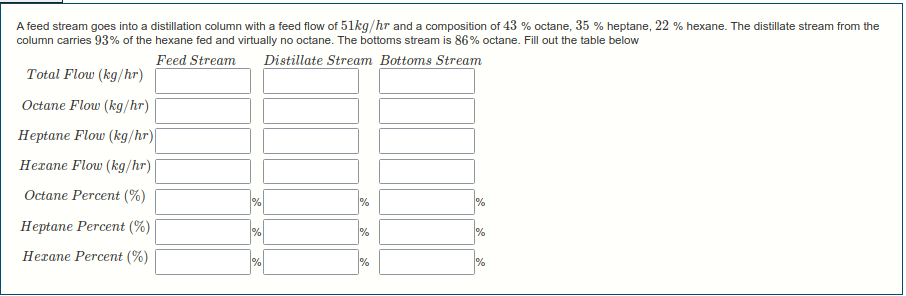
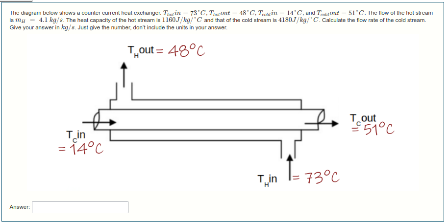
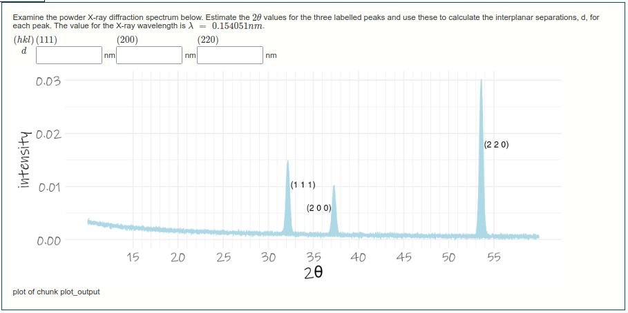

```{css, echo = FALSE}
.thumbnail {
  border: 1px solid black;
}
```

```{r setup, include = FALSE}
library(tidyverse)
library(knitr)
knitr::opts_chunk$set(echo = FALSE,
                      message = FALSE,
                      warning = FALSE)
```


I do a lot of work using online assessments, using the moodle learning platform. At the start of COVID lock-down, I figured I better up my game and so started extensively using the [R/Exams](http://www.r-exams.org/) package maintained by Achim Zeileis. I liked the results, and the way we could use R code giving some neat graphics, and random numbers so every student gets a different question. I've become a resource in the university, developing quiz questions for other lecturers, often in different disciplines, which is quite rewarding. Below are some screengrabs of questions from a chemical-engineering-esque course. The rnarkdown code for these is [here](https://github.com/eugene100hickey/ManTech).

This one is about material balances around a distillation column network.

```{r}
# All defaults

```

This one is about analysis of a heat exchanger


```{r}
# All defaults

```

And this one is about x-ray diffraction patterns

```{r}
# All defaults

```