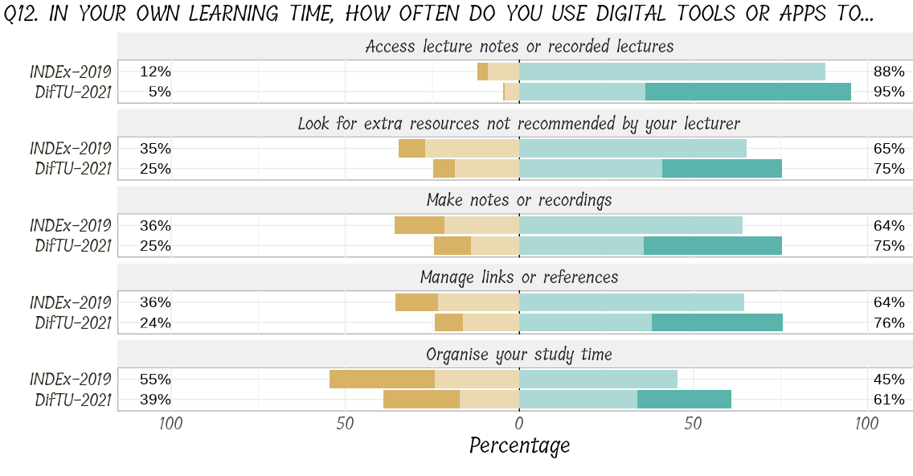
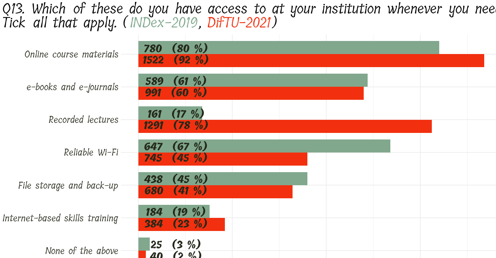
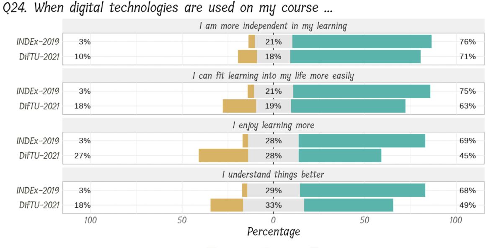

```{css, echo = FALSE}
.thumbnail {
  border: 1px solid black;
}
```

```{r setup, include = FALSE}
library(tidyverse)
library(knitr)
knitr::opts_chunk$set(echo = FALSE,
                      message = FALSE,
                      warning = FALSE)
```

<br>
<br>


### Data Insights for TU Dublin (DifTU)  

This project incorporated a survey carried out in our university at a time of severe lock-down. We asked students and staff about their digital experiences with the college, and we found some interesting results. We compared our responses to those for a similar survey from 2019, i.e. pre-COVID, called INDEx. 

From the responses to the question below, we can the impact of restrictions on new ways of course delivery, note the overall increase in all things digital from INDEx to DifTU.


```{r fig.height=10, fig.width=12}
# All defaults

```

We see an even more stark example of this in the nest question, see the dramatic rise of _Recorded Lectures_.

```{r}
# All defaults

```

And finally, it seems as the students are maxing-out on digital learning, see the responses to the questions below where there is a marked decrease from INDEx to DifTU. 

```{r}
# All defaults

```
