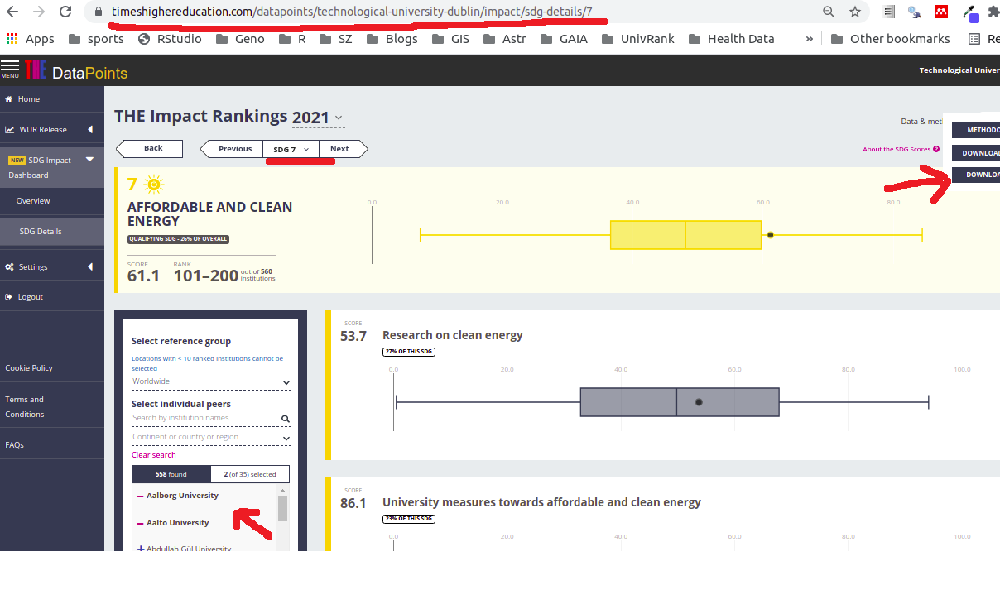

background-image: url(img/alternative_energy_revolution.jpg)
background-position: center
background-size: contain

```{r setup, include=FALSE, echo=FALSE, message=F, warning=F}
options(htmltools.dir.version = FALSE, echo = F, message = F, warning = F)
# http://stla.github.io/stlapblog/posts/Numextract.html
options("ggrepel.max.overlaps" = 40)
library(tidyverse)
library(tm)
library(ggrepel)
library(leaflet)
library(htmltools)
library(showtext)
library(extrafont)
library(collapsibleTree)
library(gt)
library(kableExtra)
library(patchwork)
library(Rtsne)
library(ggtext)
library(here)

my_font <- "Josefin Slab"
my_font <- "Indie Flower"
font_add_google(my_font, family = my_font)
showtext_auto()
theme_set(theme_minimal() +
            theme(text = element_text(family = my_font, size = 28)))

```

```{r xaringan-extra, echo=FALSE}
library(xaringanExtra)
xaringanExtra::use_panelset()
```

```{r data, echo=FALSE, message=F, warning=F}
irish_universities <- readRDS("data/irish-universities.rds")
cohort_universities <- readRDS("data/cohort-universities.rds")

SDG7_Energy <- readRDS("data/SDG7-energy-scoring-breakdown.rds")

SDG7_Energy_metrics <- readRDS(file = "data/SDG7-Energy-metrics.rds")

overs <- readRDS("data/overs.rds")

z1 <- readRDS("data/SDG7-shuffled-data.rds")

zq <- readRDS("data/zq.rds")

zp <- z1 %>%
  select(university, `Affordable and clean energy: CiteScore`:`Assistance to low-carbon innovation`) %>% 
  pivot_longer(-university, names_to = "Attribute") %>% 
  left_join(zq) %>% 
  mutate(value = as.numeric(value) * Weight / 100) %>% 
  select(university, Attribute, value) %>% 
  pivot_wider(names_from = "Attribute", values_from = "value")
z5 <- Rtsne(zp %>% 
              select(`Affordable and clean energy: CiteScore`:`Assistance to low-carbon innovation`) %>% 
              as.matrix() %>%
              sapply(as.numeric) %>% 
              matrix(nrow = 559, ncol = 15) %>% 
              normalize_input() %>% 
              dist(), 
            perplexity = 10,
            theta = 0.0)
z6 <- tibble(x = z5$Y[,1], 
       y = z5$Y[,2], 
       label = z1$university, 
       score = z1$score,
       irish_uk = z1$irish_uk,
       irish = z1$irish,
       cohort = z1$cohort)
tud_x <- z6[z6$label == 'Technological University Dublin','x']
tud_y <- z6[z6$label == 'Technological University Dublin','y']


z6 <- z6 %>%
  mutate(close = between(x, tud_x$x-8, tud_x$x+8) & between(y, tud_y$y-5, tud_y$y+5))


SDG7 <- function(df = z1, my_university = irish_universities, metric = "Research on clean energy") {
  variables <- SDG7_Energy_metrics %>% 
    filter(Metric == metric) %>% 
    pull(Indicator)
  z2 <- df %>% 
    select(university, 
           variables,
           inverse_ranking) %>% 
    pivot_longer(cols = -c(university, inverse_ranking), values_to = "score") %>% 
    mutate(score = as.numeric(score),
           univ_label = abbreviate(university, 10))
  
  z2 %>% ggplot(aes(name, score)) + 
    geom_boxplot(width = 0.2) + 
    geom_point(data = z2 %>% 
                 filter(university %in% my_university$university) %>% 
                 left_join(my_university), 
               aes(y=score, x=name, color = pal(inverse_ranking)),
               show.legend = F) + 
    geom_text_repel(data = z2 %>% 
                      filter(university %in% my_university$university,
                             university != "Technological University Dublin") %>% 
                      left_join(my_university), 
                    aes(label = abbrev, y = score, 
                        x = name, color = pal(inverse_ranking)),
                    family = my_font,
                    show.legend = F,
                    size = 6,
                    fontface = "bold") +
    geom_text_repel(data = z2 %>% 
                      filter(university == "Technological University Dublin") %>% 
                      left_join(my_university), 
                    aes(label = abbrev, y = score, 
                        x = name),
                    family = my_font,
                    show.legend = F,
                    size = 10,
                    fontface = "bold") +
    geom_point(data = z2 %>% 
                 filter(university  == "Technological University Dublin") %>% 
                 left_join(my_university), 
               aes(y=score, x=name),
               size = 3,
               show.legend = F) + 
    ggtitle(label = metric) +
    theme(axis.title = element_blank(),
          legend.position = "none",
          plot.title.position = "plot",
          plot.title = element_text(size=24),
          axis.text.y = element_text(size=12)) + 
    scale_x_discrete(labels = function(x) str_wrap(x, width = 20)) +
    coord_flip()
}


# Create a continuous palette function
pal <- colorNumeric(
  palette = "Reds",
  domain = overs$inverse_ranking)
```


???

Image credit: [Wikimedia Commons](https://commons.wikimedia.org/wiki/File:Sharingan_triple.svg)

---
class: center, middle

# THE University Rankings

## ... based on energy


---


# Outline


1. Describe Structure of THE - SDG7 - Energy Rankings  

2. Accessing the Data  

3. Comparison Universities  

4. First Look at the Data  

5. Map  

6. Overall Scores  

6. Overall Comparisons

7. Research on clean energy

8. University measures towards affordable and clean energy

9. Energy use density

10. Energy and the community

11. Conclusions

---

.panelset[

.panel[
.panel-name[Metrics]

### Click on nodes to expand / collapse

```{r collapsibleTree, echo=FALSE, fig.align='center', fig.width=12}
tree <- collapsibleTree(
  SDG7_Energy,
  fontSize = 12,
  linkLength = 100,
  hierarchy = c("Metric", "Indicator"), 
  fill = c(
    # The root
    "seashell",
    # Unique regions
    rep("brown", length(unique(SDG7_Energy$Metric))),
   # Unique names per region
    rep("forestgreen", length(unique(paste(SDG7_Energy$Indicator, SDG7_Energy$Metric))))
  )
)
tree[[1]]$options$margin$left <- 280
tree[[1]]$options$margin$right <- 100
tree
```

] <!-- end of panel -->


.panel[
.panel-name[Webpage]




] <!-- end of panel -->

.panel[
.panel-name[Comparison]

### These are the universities that we'll use to compare to TUD

.pull-left[

```{r irish_unis, echo=FALSE}
irish_universities %>% 
  gt()
```

]

.pull-right[

```{r compare_unis, echo=FALSE}
cohort_universities %>% 
  gt()
```

]


] <!-- end of panel -->

.panel[
.panel-name[Data]

```{r all_data, echo=FALSE}
z3 <- z1 %>% 
  select(university:`Assistance to low-carbon innovation`)
z2 <- z3 %>% column_to_rownames(var = "university")
z2 <- slice(z2, sample(1:n()))
rownames(z2) <- z3$university
z2 <- select(z2, one_of(sample(names(z2)))) 
names(z2) <- names(z3)[-1]
z2 <- z2 %>% rownames_to_column(var = "university")
z2 %>%
  kable("html") %>%
  kable_styling() %>%
  scroll_box(
    height = "500px",
    box_css = "border: 1px solid #ddd; padding: 5px; ",
    fixed_thead = TRUE
  )
```


] <!-- end of panel -->

.panel[
.panel-name[Map]

- Dark red indicates a high score / click on the circles to see details

```{r map, echo=FALSE, message=F, warning=F, fig.width=10}
z1 %>% leaflet() %>% 
  addProviderTiles("Esri.NatGeoWorldMap") %>% 
  addCircleMarkers(popup = ~glue::glue("<b>{university}</b>
                                       <br/>Score: {round(score, 1)}%
                                       <br/><b>Ranking: {ranking}</b>
                                       <br/>Research on clean energy: {`Research on clean energy`}%
                                       <br/>Uni. measures for affordable & clean energy: {`University measures towards affordable and clean energy`}%
                                       <br/>Energy use density: {`Energy use density`}%
                                       <br/>Energy and the community: {`Energy and the community`}%"),
                   lng = ~long, 
                   lat = ~lat,
                   fill = ~pal(inverse_ranking),
                   color = ~pal(inverse_ranking)) %>% 
  setView(lng = -8, lat = 55, zoom = 4)
```


] <!-- end of panel -->

.panel[
.panel-name[Score]


```{r overall, echo=FALSE, message=F, warning=F, fig.width=10}
irish <- overs %>% 
  ggplot(aes(1, score)) + 
  geom_violin(fill = "gray80", alpha = 0.5) + 
  geom_point(data = overs %>% 
               filter(university %in% irish_universities$university), 
             aes(y=score, x=1, color = pal(inverse_ranking)),
             show.legend = F) + 
  geom_text_repel(data = overs %>% 
                    filter(university %in% irish_universities$university), 
                  aes(label = university, y = score, x = 1, color = pal(inverse_ranking)),
                  family = my_font,
                  size = 8,
                  show.legend = F) + 
  coord_flip() +
  theme(axis.title.y = element_blank(),
        axis.text.y = element_blank())
international <- overs %>% 
  ggplot(aes(1, score)) + 
  geom_violin(fill = "gray80", alpha = 0.5) + 
  geom_point(data = overs %>% 
               filter(university %in% cohort_universities$university), 
             aes(y=score, x=1, color = pal(inverse_ranking)),
             show.legend = F) + 
  geom_text_repel(data = overs %>% 
                    filter(university %in% cohort_universities$university) %>% 
                    left_join(cohort_universities), 
                  aes(label = abbrev, y = score, x = 1, color = pal(inverse_ranking)),
                  family = my_font,
                  size = 10,
                  show.legend = F,
                  max.overlaps = 20) + 
  coord_flip() +
  theme(axis.title.y = element_blank(),
        axis.text.y = element_blank())
irish / international
```


]<!-- end of panel -->

]<!-- end of panelset -->

---

.panelset[

.panel[
.panel-name[7a]

```{r energy_a, echo=FALSE, message=F, warning=F, fig.width=10}
z2 <- z1 %>% 
  select(university, 
         inverse_ranking,
         `Research on clean energy`, 
         `University measures towards affordable and clean energy`, 
         `Energy use density`,
         `Energy and the community`) %>% 
  pivot_longer(cols = -c(university, inverse_ranking), values_to = "score") %>% 
  mutate(score = as.numeric(score),
         univ_label = abbreviate(university, 10),
         name = factor(name, levels = c("Research on clean energy",
                                        "University measures towards affordable and clean energy",
                                        "Energy use density",
                                        "Energy and the community")))
z2 %>% ggplot(aes(name %>% fct_rev(), score)) + 
  geom_boxplot(width = 0.2) + 
  geom_point(data = z2 %>% 
               filter(university %in% irish_universities$university) %>% 
               left_join(irish_universities), 
             aes(y=score, x=name, color = pal(inverse_ranking)),
             show.legend = F) + 
  geom_text_repel(data = z2 %>% 
                    filter(university %in% irish_universities$university,
                           university != "Technological University Dublin") %>% 
                    left_join(irish_universities), 
                  aes(label = abbrev, y = score, 
                      x = name, color = pal(inverse_ranking)),
                  family = my_font,
                  show.legend = F,
                  size = 6,
                  fontface = "bold",
                  max.overlaps = 40) +
  geom_text_repel(data = z2 %>% 
                    filter(university == "Technological University Dublin") %>% 
                    left_join(irish_universities), 
                  aes(label = abbrev, y = score, 
                      x = name),
                  family = my_font,
                  show.legend = F,
                  size = 10,
                  fontface = "bold",
                  max.overlaps = 40) +
  geom_point(data = z2 %>% 
               filter(university  == "Technological University Dublin") %>% 
               left_join(irish_universities), 
             aes(y=score, x=name),
             size = 3,
             show.legend = F) + 
  ggtitle(label = "SDG7 - Energy") +
  theme(axis.title = element_blank(),
        legend.position = "none",
        plot.title.position = "plot",
        plot.title = element_text(size=24),
        axis.text.y = element_text(size=12)) + 
  scale_x_discrete(labels = function(x) str_wrap(x, width = 20)) +
  coord_flip()
```


]<!-- end of panel -->


.panel[
.panel-name[7b]

```{r energy_b, echo=FALSE, message=F, warning=F, fig.width=10}
z2 %>% ggplot(aes(name %>% fct_rev(), score)) + 
  geom_boxplot(width = 0.2) + 
  geom_point(data = z2 %>% 
               filter(university %in% cohort_universities$university) %>% 
               left_join(cohort_universities), 
             aes(y=score, x=name, color = pal(inverse_ranking)),
             show.legend = F) + 
  geom_text_repel(data = z2 %>% 
                    filter(university %in% cohort_universities$university,
                           university != "Technological University Dublin") %>% 
                    left_join(cohort_universities), 
                  aes(label = abbrev, y = score, 
                      x = name, color = pal(inverse_ranking)),
                  family = my_font,
                  show.legend = F,
                  size = 6,
                  fontface = "bold",
                  max.overlaps = 400) +
  geom_text_repel(data = z2 %>% 
                    filter(university == "Technological University Dublin") %>% 
                    left_join(cohort_universities), 
                  aes(label = abbrev, y = score, 
                      x = name),
                  family = my_font,
                  show.legend = F,
                  size = 10,
                  fontface = "bold",
                  max.overlaps = 4) +
  geom_point(data = z2 %>% 
               filter(university  == "Technological University Dublin") %>% 
               left_join(cohort_universities), 
             aes(y=score, x=name),
             size = 3,
             show.legend = F) + 
  ggtitle(label = "SDG7 - Energy") +
  theme(axis.title = element_blank(),
        legend.position = "none",
        plot.title.position = "plot",
        plot.title = element_text(size=24),
        axis.text.y = element_text(size=12)) + 
  scale_x_discrete(labels = function(x) str_wrap(x, width = 20)) +
  coord_flip()
```

]<!-- end of panel -->


.panel[
.panel-name[8a]

```{r clean_energy_a, echo=FALSE, message=F, warning=F, fig.width=10}
SDG7(my_university = irish_universities)
```

]<!-- end of panel -->

.panel[
.panel-name[8b]

```{r clean_energy_b, echo=FALSE, message=F, warning=F, fig.width=10}
SDG7(my_university = cohort_universities)
```

]<!-- end of panel -->

.panel[
.panel-name[9a]

```{r affordable_energy_a, echo=FALSE, message=F, warning=F, fig.width=10}
SDG7(my_university = irish_universities, metric = "University measures towards affordable and clean energy")
```


]<!-- end of panel -->


.panel[
.panel-name[9b]

```{r affordable_energy_b, echo=FALSE, message=F, warning=F, fig.width=10}
SDG7(my_university = cohort_universities, metric = "University measures towards affordable and clean energy")
```

]<!-- end of panel -->

.panel[
.panel-name[10a]

```{r use_energy_a, echo=FALSE, message=F, warning=F, fig.width=10}
SDG7(my_university = irish_universities, metric = "Energy use density")
```


]<!-- end of panel -->


.panel[
.panel-name[10b]

```{r use_energy_b, echo=FALSE, message=F, warning=F, fig.width=10}
SDG7(my_university = cohort_universities, metric = "Energy use density")
```

]<!-- end of panel -->


.panel[
.panel-name[11a]

```{r community_energy_a, echo=FALSE, message=F, warning=F, fig.width=10}
SDG7(my_university = irish_universities, metric = "Energy and the community")
```


]<!-- end of panel -->


.panel[
.panel-name[11b]

```{r community_energy_b, echo=FALSE, message=F, warning=F, fig.width=10}
SDG7(my_university = cohort_universities, metric = "Energy and the community")
```

]<!-- end of panel -->

] <!-- end of panelset -->

---

# Conclusions

1. Seems to be an issue with _Energy Use Density_ (worth 27%) in Ireland, and even in the UK, compared with _Rest of World_.

2. We do badly on:

- _Upgrade Buildings for Higher Energy Efficiency_ (worth 3.85%)
- _Local Community Outreach for Energy Efficiency_ (worth 4.60%)
- _100% Renewable Energy Pledge_ (worth 4.60%)

---

### Appendix 1

Is the _Energy Use Density_ measured differently in Ireland / UK?

```{r energy_use_density_comparison, echo=FALSE, message=F, warning=F, fig.width=10, fig.height=6}
my_colours = c("#074004", "#995d53")

z1 %>% 
  ggplot(aes(`Energy use density`, fill = irish_uk, col = irish_uk)) +
  scale_color_manual(values = my_colours) +
  scale_fill_manual(values = my_colours) + 
  geom_density(alpha = 0.4, show.legend = F) +
  geom_rug(aes(col = irish_uk), show.legend = F) +
  labs(title = "Energy Use Density for <i style = 'color:#04590e;'>Irish-Uk</i> and <i style = 'color:#995d53;'>Rest of World</i> Universities") +
  theme(plot.title = element_markdown(size = 18),
        plot.title.position = "plot")
```

Looks like it is, Irish-UK between 0% and 50%, Rest of World evenly spread.

---

In the plot below, universities that are points closer together are more similar (as measured by [t-SNE](https://en.wikipedia.org/wiki/T-distributed_stochastic_neighbor_embedding)).

.panelset[

.panel[
.panel-name[Irish]

```{r tsne-irish, echo=FALSE, message=F, warning=F, fig.width=10, fig.height=6}
z6 %>% 
  ggplot(aes(x, y, label = label)) + 
  geom_point(aes(fill = score), 
             shape=21, 
             size=5,
             alpha = 0.5,
             show.legend = F) + 
  geom_text_repel(data = z6 %>% 
                    filter(irish),
                  aes(x, y, label = label %>% str_wrap(20)),
                  family = my_font, 
                  size = 6, 
                  show.legend = F,
                  max.overlaps = 40) +
  geom_point(data = z6 %>% 
               filter(irish),
             fill = "red", 
             shape=21, 
             size=2,
             alpha = 1,
             show.legend = F) + 
  scale_color_discrete(aes(irish)) +
  scale_fill_gradient(low = "lightblue1", high = "darkblue") +
  theme_void() +
  theme(panel.background = element_rect(fill = "snow1"),
        text = element_text(size = 8, face = "bold"))
```

]<!-- end of panel -->

.panel[
.panel-name[Cohort]

```{r tsne-cohort, echo=FALSE, message=F, warning=F, fig.width=10, fig.height=6}
z6 %>% 
  ggplot(aes(x, y, label = label)) + 
  geom_point(aes(fill = score), 
             shape=21, 
             size=5,
             alpha = 0.5,
             show.legend = F) + 
  geom_text_repel(data = z6 %>% 
                    filter(cohort),
                  aes(x, y, label = label %>% str_wrap(20)),
                  family = my_font, 
                  size = 6, 
                  show.legend = F,
                  max.overlaps = 40) +
  geom_point(data = z6 %>% 
               filter(cohort),
             fill = "red", 
             shape=21, 
             size=2,
             alpha = 1,
             show.legend = F) + 
  scale_color_discrete(aes(cohort)) +
  scale_fill_gradient(low = "lightblue1", high = "darkblue") +
  theme_void() +
  theme(panel.background = element_rect(fill = "snow1"),
        text = element_text(size = 8))
```

]<!-- end of panel -->

.panel[
.panel-name[Close]

```{r tsne-close, echo=FALSE, message=F, warning=F, fig.width=10, fig.height=6}
z6 %>% 
  ggplot(aes(x, y, label = label)) + 
  geom_point(aes(fill = score), 
             shape=21, 
             size=5,
             alpha = 0.5,
             show.legend = F) + 
  geom_text_repel(data = z6 %>% 
                    filter(close),
                  aes(x, y, label = label %>% str_wrap(20)),
                  family = my_font, 
                  size = 6, 
                  show.legend = F,
                  max.overlaps = 40) +
  geom_point(data = z6 %>% 
               filter(close),
             fill = "red", 
             shape=21, 
             size=2,
             alpha = 1,
             show.legend = F) + 
  scale_color_discrete(aes(close)) +
  scale_fill_gradient(low = "lightblue1", high = "darkblue") +
  theme_void() +
  theme(panel.background = element_rect(fill = "snow1"),
        text = element_text(size = 8))
```
]<!-- end of panel -->

]<!-- end of panelset -->