<style type="text/css">

.navbar-inverse {
  background-color: #178340;
  border-color: #178340 ;
}

.storyboard-nav .sbframelist ul li.active {
   background-color: rgba(23, 105, 64, 0.85);
}


.storyboard-nav .sbframelist {
margin: 0 auto;
width: 94%;
height: 50px;
overflow: hidden;
text-shadow: none;
margin-bottom: 8px;
color: #3cbc8d;
}

.storyboard-nav .sbnext, .storyboard-nav .sbprev {
float: left;
width: 2%;
height: 50px;
font-size: 40px;
color: #3cbc8d;
}

column-left{
  float: left;
  width: 25%;
  text-align: left;
}
.column-center{
  display: inline-block;
  width: 25%;
  text-align: center;
}
.column-right{
  float: right;
  width: 25%;
  text-align: right;
}

h1 {
  line-height: 1.8;
}

* {
  box-sizing: border-box;
}

/* Create three unequal columns that floats next to each other */
.column {
  float: left;
}

.left, .right {
  width: 33.3%;
}

.middle {
  width: 33.3%;
}

/* Clear floats after the columns */
.row:after {
  content: "";
  display: table;
  clear: both;
}

</style>


Let it tell a story {.storyboard}
=========================================


### Penguins

<div class="column left">
<center>

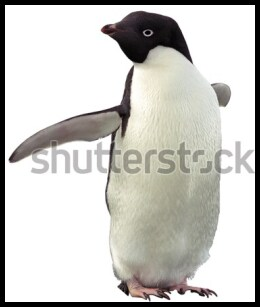

</center>
</div>

<div class="column middle">
<center>

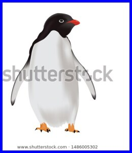

</center>
</div>

<div class="column right">
<center>

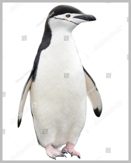

</center>
</div>

### Penguins are different

```{r penguin_histograms, fig.width = 12, fig.height = 4, echo = F, message=F, warning=FALSE, cache=T}
library(tidyverse)
library(palmerpenguins)
library(showtext)
library(extrafont)
library(ggpubr)
library(patchwork)
library(broom)
library(ranger)
library(ggtext)


font_add("Ink Free", "fonts/Inkfree.ttf")
col = c("black", "blue", "grey70")

penguin_histograms <-
  penguins %>%
  drop_na() %>%
  ggplot(aes(flipper_length_mm, col = species)) +
  stat_density(geom = 'line',
               position = 'identity',
               alpha = 1,
               aes(fill = species),
               size = 1.5) +
  facet_grid(~ sex) +
  scale_color_manual(labels = paste("<span style='color:",
                                   col,
                                   "'>",
                                   unique(penguins$species),
                                   "</span>"),
                    values = col) +
  ylab("") +
  xlab(label = "Flipper Length (mm)") +
  theme_minimal() +
  theme(axis.text = element_blank(),
        legend.title = element_blank(),
        legend.text = element_markdown(family = "Ink Free",
                                       size = 32),
        text = element_text(family = "Ink Free", size = 24),
        strip.text = element_text(size = 32)) +
  geom_rug()

penguin_legend <- get_legend(penguin_histograms) %>% as_ggplot()
penguin_histograms <- penguin_histograms +
    theme(legend.position = "none")

penguin_histograms + penguin_legend

```


### So let's measure

```{r penguin_plotss, echo = F, message=F, warning=FALSE, cache=T}
penguin_plots1 <-
  penguins %>%
  drop_na() %>%
  ggplot(aes(body_mass_g, flipper_length_mm, col = species)) +
  geom_point(alpha = 0.8, show.legend = F) +
  scale_color_manual(values = col) +
  xlab("Body Mass (g)") +
  ylab(label = "Flipper Length (mm)") +
  theme_minimal() +
  theme(axis.text = element_blank(),
        text = element_text(family = "Ink Free", size = 16)) +
  coord_cartesian(xlim = c(2500, 6500)) +
  ggalt::geom_encircle(show.legend = F)


penguin_plots2 <-
  penguins %>%
  drop_na() %>%
  ggplot(aes(bill_depth_mm, bill_length_mm, col = species)) +
  geom_point(alpha = 0.8, show.legend = F) +
  scale_color_manual(values = col) +
  xlab("Bill Depth (mm)") +
  ylab(label = "Bill Length (mm)") +
  theme_minimal() +
  theme(axis.text = element_blank(),
        text = element_text(family = "Ink Free", size = 16)) +
  coord_cartesian(xlim = c(10, 25)) +
  ggalt::geom_encircle(show.legend = F)

penguin_plots2 + penguin_plots1
```

### Does it work?

```{r penguin_model, echo = F, message=F, warning=FALSE, cache=T}
set.seed(42)
penguins_clean <- penguins %>% select(-island) %>% drop_na()
nobs <- nrow(penguins_clean)

index  <- sample(nobs, 0.7*nobs)
train <- penguins_clean[index,]
test <- penguins_clean[-index,]

model <- ranger(data = train,
                formula = species ~.,
                mtry = 5,
                importance = "impurity")

model_importance <- model$variable.importance %>%
  tidy() %>%
  dplyr::arrange(desc(x)) %>%
  ggplot(aes(reorder(names, x), x, fill = names)) +
  xlab("") +
  ylab("") +
  geom_col(show.legend = F) +
  scale_fill_viridis_d() +
  theme_minimal() +
  theme(axis.text.x = element_blank()) +
  coord_flip() +
  ggtitle("Most Important Variables")

model_importance


```

***

<div class="column-left">
<center>

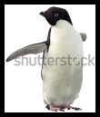

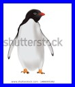

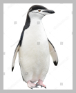

</center>
</div>

<div class="column-right">

<br>

<span style='color:black'>Adelie by Leksele (Shutterstock)</span>

<br>
<br>
<br>

<span style='color:blue'>Gentoo by Vittaya Pinpan (Shutterstock)</span>

<br>
<br>
<br>

<span style='color:grey'>Chinstrap by Alexey Seafarer (Shutterstock)</span>


</div>


Let's look at data {.storyboard}
=========================================

### The Traditional


***

- old favourites
    - histograms
    - boxplots
    - bar chart
    - line plots....
- lot of creative twists in R
- maps
- networks
- interactive
- animated
- 3D....
- karyograms
- and more
    - finishing touches that bring a graphic to life
    - colour schemes, annotations, scales....

### Animations

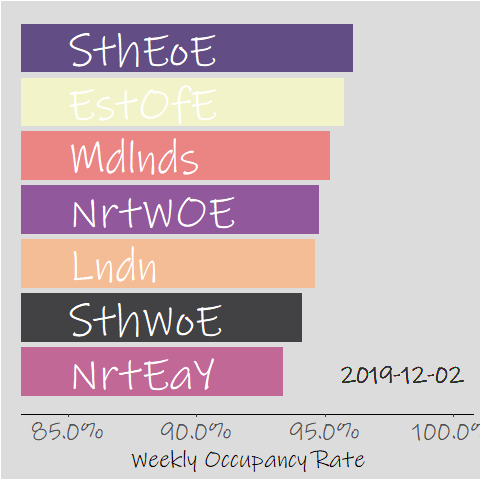

***

- old favourites
    - histograms
    - boxplots
    - bar chart
    - line plots....
- lot of creative twists in R
- maps
- networks
- interactive
- animated
- 3D....
- karyograms
- and more
    - finishing touches that bring a graphic to life
    - colour schemes, annotations, scales....
    
    
### Networks

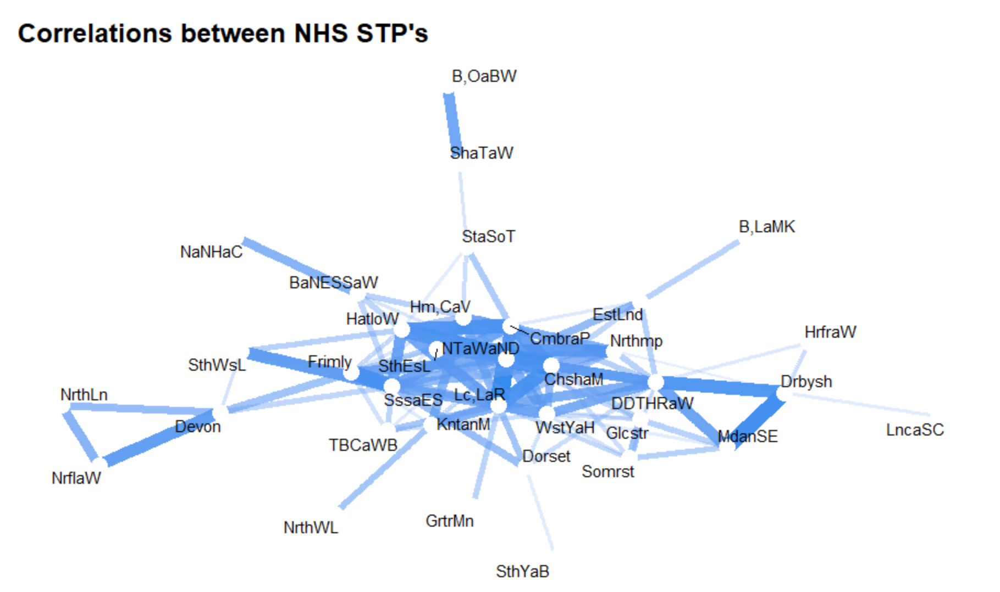

***

- old favourites
    - histograms
    - boxplots
    - bar chart
    - line plots....
- lot of creative twists in R
- maps
- networks
- interactive
- animated
- 3D....
- karyograms
- and more
    - finishing touches that bring a graphic to life
    - colour schemes, annotations, scales....


### Annotations

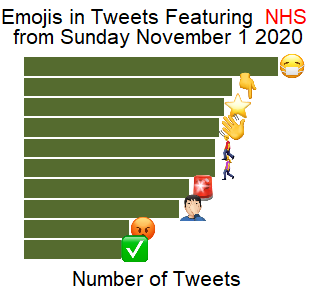

***

- old favourites
    - histograms
    - boxplots
    - bar chart
    - line plots....
- lot of creative twists in R
- maps
- networks
- interactive
- animated
- 3D....
- karyograms
- and more
    - finishing touches that bring a graphic to life
    - colour schemes, annotations, scales....


### Maps

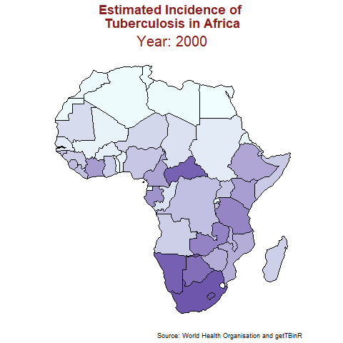

***

- old favourites
    - histograms
    - boxplots
    - bar chart
    - line plots....
- lot of creative twists in R
- maps
- networks
- interactive
- animated
- 3D....
- karyograms
- and more
    - finishing touches that bring a graphic to life
    - colour schemes, annotations, scales....


### Word Clouds

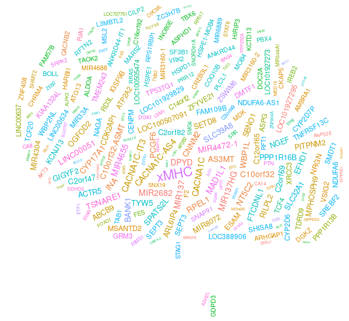

***

- old favourites
    - histograms
    - boxplots
    - bar chart
    - line plots....
- lot of creative twists in R
- maps
- networks
- interactive
- animated
- 3D....
- karyograms
- and more
    - finishing touches that bring a graphic to life
    - colour schemes, annotations, scales....

### Niche Applications

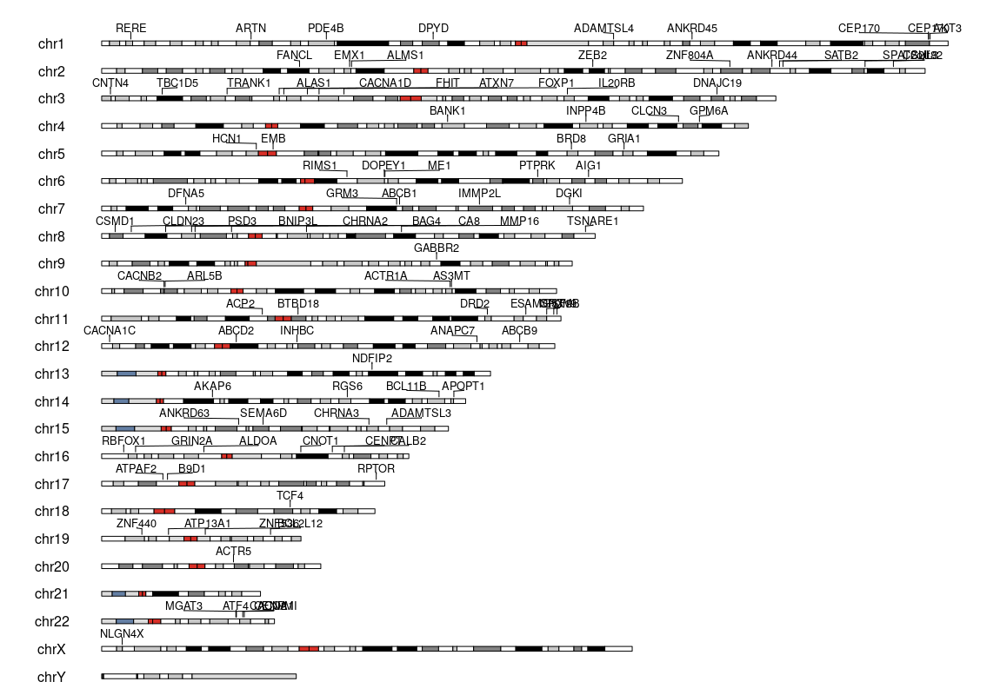

***

- old favourites
    - histograms
    - boxplots
    - bar chart
    - line plots....
- lot of creative twists in R
- maps
- networks
- interactive
- animated
- 3D....
- karyograms
- and more
    - finishing touches that bring a graphic to life
    - colour schemes, annotations, scales....


And so much out there {.storyboard}
=========================================

### And so much out there

<h1 style="font-size:2vw">

- R community eager and energetic in sharing ideas
- My goto places
    - Rweekly.org
    - #rstats
    - r-bloggers.com

</h1>

### Easy because so much out there

<h1 style="font-size:2vw">

- and in that vein....
    - Shannon Pileggi (pipinghotdata.com) for the flexdashboard idea
    - @Allison_Horst for the graphics
    - @bradleyboehmke for the variable importance chart
    - @Fiona_Grimm (Health Foundation for shaping the NHS data)
    - Gina Reynolds for the bar chart race
    - Emil Hvitfeldt for the emoji plot

</h1>
