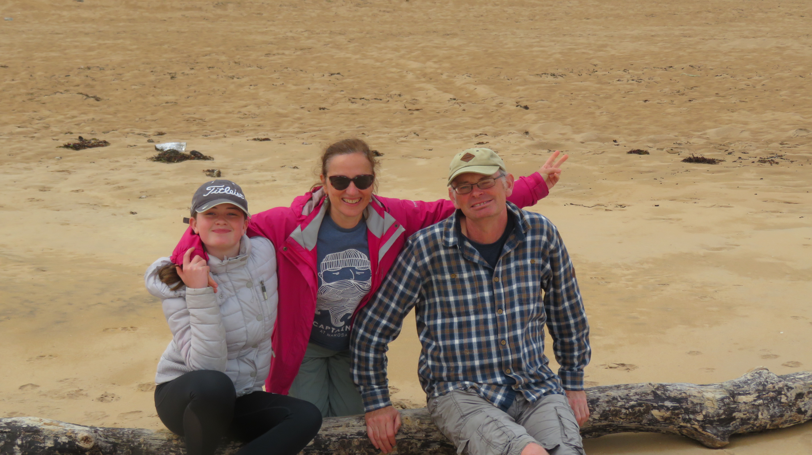

<style>
d-title {
 display:none;
}
body {
  font-size: 18px;
  line-height: 1.4;
  font-family: var(--body-font), var(--body-default);
}

@page{
  size: letter portrait;
  margin: 1in 0.5in 1in 0.25in;
}

a {
  color: #FFB6C1;
}

*{
  box-sizing: border-box;
}

:root{
  --page-width: 8.5in;
}


#canvas {
    max-width: var(--page-width);
    margin: auto;
}

.distill-site-footer {
  --text-color:       rgba(0, 0, 0, 1);
  --text-size:        15px;
  --hover-color:      black;
  --bkgd-color:       white;
}

.profile-photo {
  vertical-align: middle;
  padding: 1.5rem!important;
  box-sizing: border-box;
}

.profile-photo img {
  // border: 1px solid black;
  border-radius: 50%!important;
  width: 12rem!important;
}


/* --- github calender --- */

:root {
  --color-calendar-graph-day-bg: #dddbdb;
  --color-calendar-graph-day-L1-bg: #cd669b;
  --color-calendar-graph-day-L2-bg: #bd327a;
  --color-calendar-graph-day-L3-bg: #ad0059;
  --color-calendar-graph-day-L4-bg: #79003e;
}

rect.ContributionCalendar-day[data-level='0'] {
    fill: var(--color-calendar-graph-day-bg);
}

rect.ContributionCalendar-day[data-level='1'] {
    fill: var(--color-calendar-graph-day-L1-bg);
}

rect.ContributionCalendar-day[data-level='2'] {
    fill: var(--color-calendar-graph-day-L2-bg);
}

rect.ContributionCalendar-day[data-level='3'] {
    fill: var(--color-calendar-graph-day-L3-bg);
}

rect.ContributionCalendar-day[data-level='4'] {
    fill: var(--color-calendar-graph-day-L4-bg);
}

.calendar {
    width: 100%;
    background-color: white;
    font-family: Helvetica, arial;
    border: 1px solid #DDDDDD;
    border-radius: 3px;
    min-height: 243px;
    text-align: center;
    margin: 0 auto;
    padding: 10px;
    color: black;
}

.js-calendar-graph-svg {
  width: 100%;
}

.calendar-graph text.wday,
.calendar-graph text.month {
    font-size: 10px;
    fill: #aaa;
}

.contrib-legend {
    text-align: right;
    padding: 0 10px 10px 0;
    display: inline-block;
    float: right;
}

.contrib-legend .legend {
    display: inline-block;
    list-style: none;
    margin: 0 5px;
    position: relative;
    bottom: -1px;
    padding: 0;
}

.contrib-legend .legend li {
    display: inline-block;
    width: 10px;
    height: 10px;
}

.text-small {
    font-size: 12px;
    color: #767676;
}

.calendar-graph {
    padding: 5px 0 0;
    text-align: center;
}

.contrib-column {
    padding: 15px 0;
    text-align: center;
    border-left: 1px solid #ddd;
    border-top: 1px solid #ddd;
    font-size: 11px;
}

.contrib-column-first {
    border-left: 0;
}

.table-column {
    display: table-cell;
    width: 5%;
    padding-right: 10px;
    padding-left: 10px;
    vertical-align: top;
}

.contrib-number {
    font-weight: 300;
    line-height: 1.3em;
    font-size: 24px;
    display: block;
    color: #333;
}

.calendar img.spinner {
    width: 70px;
    margin-top: 50px;
    min-height: 70px;
}

.ContributionCalendar-label {
  font-size: 8pt;
}

.monospace {
    text-align: center;
    color: #000;
    font-family: monospace;
}

.monospace a {
    color: #1D75AB;
    text-decoration: none;
}

.contrib-footer {
    font-size: 11px;
    padding: 0 10px 12px;
    text-align: left;
    width: 100%;
    box-sizing: border-box;
    height: 26px;
}

.left.text-muted {
    float: left;
    margin-left: 9px;
    color: #767676;
}
.left.text-muted a {
    color: #4078c0;
    text-decoration: none;
}
.left.text-muted a:hover,
.monospace a:hover {
    text-decoration: underline;
}

h2.f4.text-normal.mb-3 {
    display: none;
}

.float-left.text-gray {
    float: left;
}
#user-activity-overview{
    display:none;
}

.day-tooltip {
    white-space: nowrap;
    position: absolute;
    z-index: 99999;
    padding: 10px;
    font-size: 12px;
    color: #959da5;
    text-align: center;
    background: rgba(0,0,0,.85);
    border-radius: 3px;
    display: none;
    pointer-events: none;
}
.day-tooltip strong {
    color: #dfe2e5;
}
.day-tooltip.is-visible {
    display: block;
}
.day-tooltip:after {
    position: absolute;
    bottom: -10px;
    left: 50%;
    width: 5px;
    height: 5px;
    box-sizing: border-box;
    margin: 0 0 0 -5px;
    content: " ";
    border: 5px solid transparent;
    border-top-color: rgba(0,0,0,.85)
}


.navbar {
  display: none; 
}
#navigation .navbar {
 display: block;
}
</style>

<div id="canvas">

<br>
<br>

<div class="profile-photo">
  
</div>

I lecture in physics at the Technological University Dublin and I'm a part of [ML-Labs](https://ml-labs.ie/). Research-wise, I work in data science, mostly astrophysics or neuroscience. My original background was in materials science, making new inter-metallic compounds based on uranium and looking at their structural and physical properties at temperatures down to 2.2K. I then spent some time as a medical physicist, developing teleradiology systems. But then discovered R programming about 2015 and haven't looked back since.

This blog is an eclectic set of posts featuring stuff I find interesting. I've have a fondness for maps, and specifically coordinate transformations, and especially maps of my home turf of Donegal. Over the years, I've spent a lot of time on golf courses, volleyball courts, and tennis courts, so they feature here too. I'm involved in politics. And of course there will be plenty of physics, and not just the astrophysics / neuroscience / bioinformatics stuff.


<script
  src="https://unpkg.com/github-calendar@latest/dist/github-calendar.min.js">
</script>

<div class="l-body-outset">
<a href="https://github.com/eugene100hickey">
<div class="calendar">
Loading my github calendar data.
</div>
</a>
</div>

<script>
GitHubCalendar(".calendar", "eugene100hickey", { responsive: true });
</script>

## You can find me at ...

```{r, echo = FALSE}
df <- data.frame(what = c('<i class="fab fa-twitter"></i>',
                           '<i class="fab fa-github"></i>',
                           '<i class="fas fa-envelope"></i>',
                           '<i class="fas fa-map-marker-alt"></i>'),
                 where = c("[eugene100hickey](https://twitter.com/eugene100hickey)",
                           "[eugene100hickey](https://github.com/eugene100hickey)",
                           "[eugene.hickey@tudublin.ie](eugene.hickey@tudublin.ie)",
                           "Department of Applied Science<br>Technological University Dublin,<br>Tallaght<br>D24FKT9<br>Ireland"))
knitr::kable(df, col.names = c("", ""), escape = FALSE)
```


<iframe src="https://www.google.com/maps/d/u/0/embed?mid=1m4FhES89FKiwadPn0bu8Z2d5F6COe1rU&ehbc=2E312F&zoom=6" width="640" height="480"></iframe>

You can also find me at various conferences and events. I'm a regular at the [NHSr Community Conferences](https://nhsrcommunity.com/), involved with [WhyR!](https://2021.whyr.pl/) and various [meetups in Dublin](https://www.meetup.com) (or other chapters sometimes). And I'm now using <a rel="me" href="https://mastodon.social/@eugene100hickey">Mastodon</a> quite a bit, rather than the other thing.

</div>