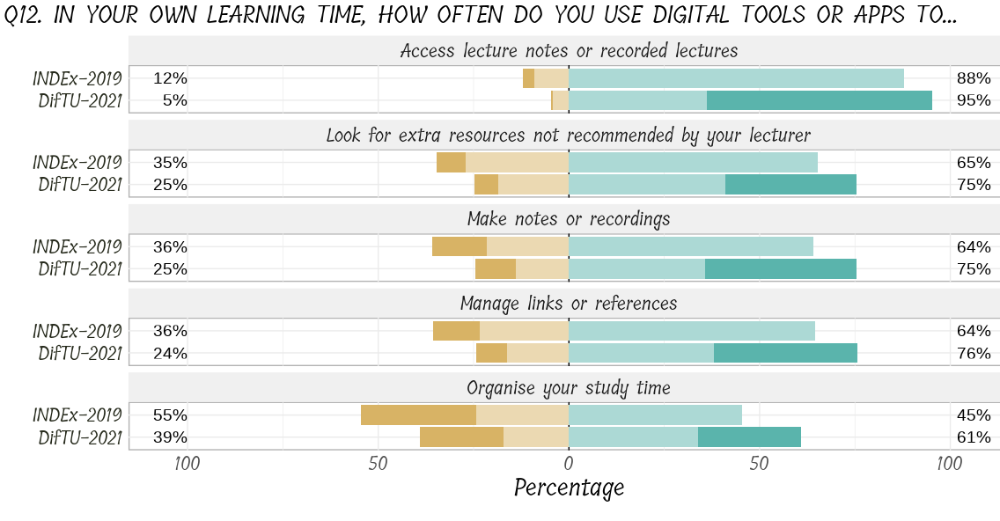
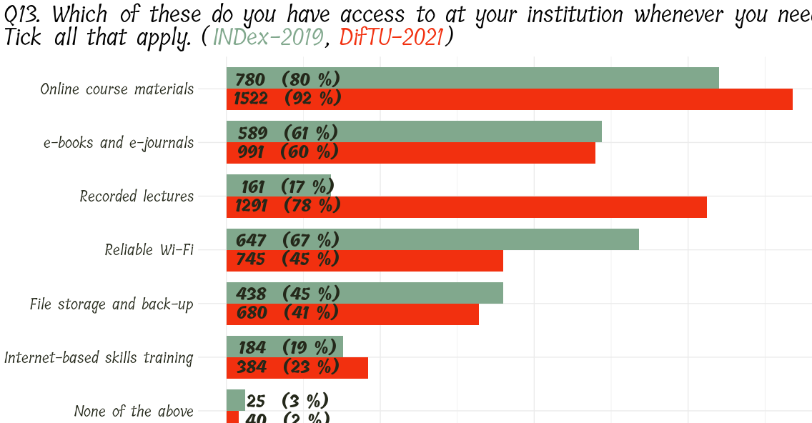
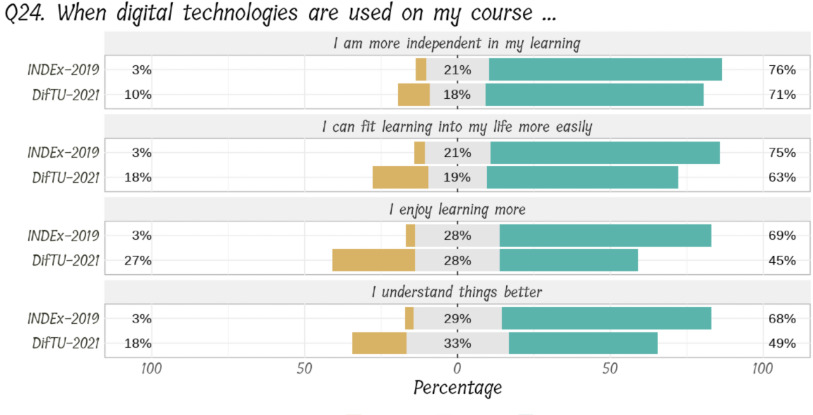
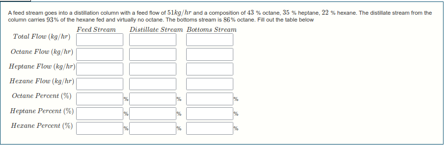
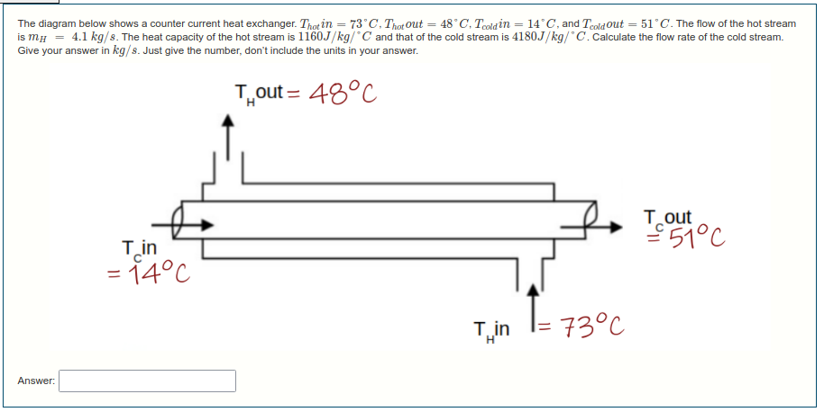
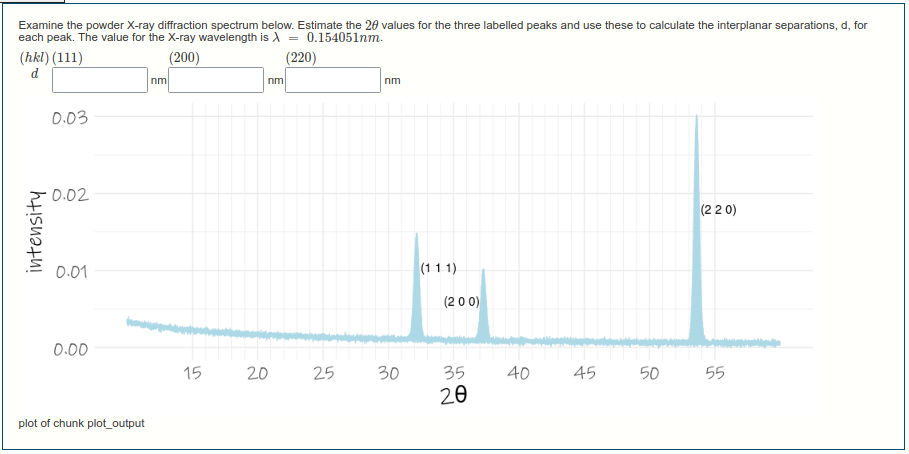

```{css, echo = FALSE}
.thumbnail {
  border: 1px solid black;
}
```

```{r setup, include = FALSE}
library(tidyverse)
library(knitr)
knitr::opts_chunk$set(echo = FALSE,
                      message = FALSE,
                      warning = FALSE)
```

<br>
<br>

### University Rankings  

I'm part of team looking at the status of TU Dublin within the university rankings world. This group is being led by [Ayesha O'Reilly](ayesha.oreilly@tudublin.ie), [Ailbhe Roche](ailbhe.roche@tudublin.ie), [Phil Mulvaney](phil.mulvaney@tudublin.ie), and [Mark Russell](mark.russell@tudublin.ie). We look at rankings from [Times Higher Education](https://www.timeshighereducation.com/datapoints), [Quacquarelli Symonds](https://www.topuniversities.com/university-rankings), and [U-Multirank](https://www.umultirank.org/), as well as keeping tabs on CAO points for our university.  

I put together presentations for the 17 Sustainability Development Goals that are part of the THE submission. [Here](projects/2021-09-04-THE/energy.html) is the one for SDG7 - Energy. Note that the data for this is confidential so the data you see above are randomly shuffled.  

### Data Insights for TU Dublin (DifTU)  

This project incorporated a survey carried out in our university at a time of severe lock-down. We asked students and staff about their digitak experiences with the college, and we found some interesting results. We compared our responses to those for a similar survey from 2019, i.e. pre-COVID, called INDEx. 

From the responses to the question below, we can the impact of restrictions on new ways of course delivery, note the overall increase in all things digital from INDEx to DifTU. dramatic rise of _Recorded Lectures_.


```{r}
# All defaults

```

We see an even more stark example of this in the nest question, see the dramatic rise of _Recorded Lectures_.

```{r}
# All defaults

```

And finally, it seems as the students are maxing-out on digital learning, see the responses to the questions below where there is a marked decrease from INDEx to DifTU. 

```{r}
# All defaults

```

### R/Exams

I do a lot of work using online assessments, using the moodle learning platform. At the start of COVID lock-down, I figured I better up my game and so started extensively using the [R/Exams](http://www.r-exams.org/) package maintained by Achim Zeileis. I liked the results, and the way we could use R code giving some neat graphics, and random numbers so every student gets a different question. I've become a resource in the university, developing quiz questions for other lecturers, often in different disciplines, which is quite rewarding. Below are some screengrabs of questions from a chemical-engineering-esque course. The rnarkdown code for these is [here](https://github.com/eugene100hickey/ManTech).

This one is about material balances around a distillation column network.

```{r}
# All defaults

```

This one is about analysis of a heat exchanger


```{r}
# All defaults

```

And this one is about x-ray diffraction patterns

```{r}
# All defaults

```